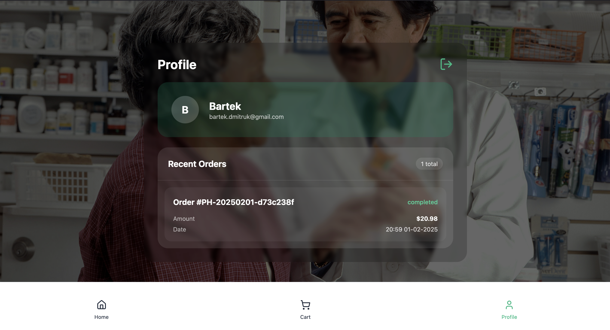
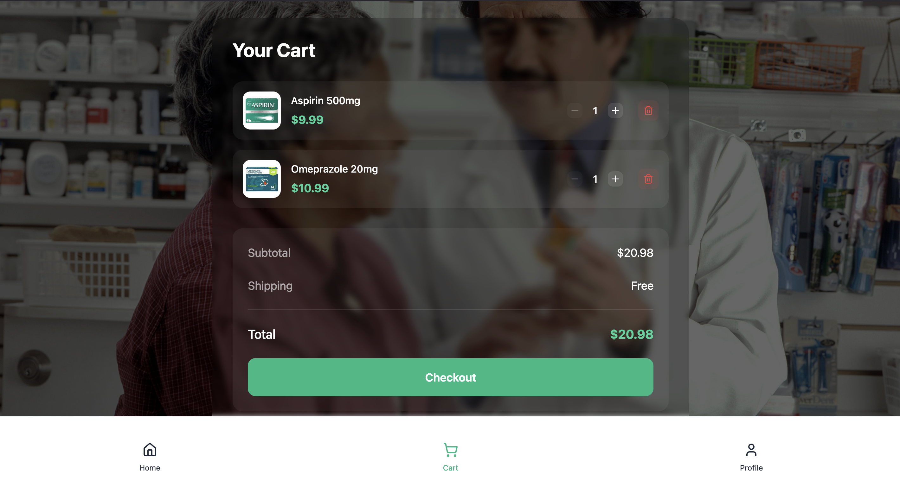
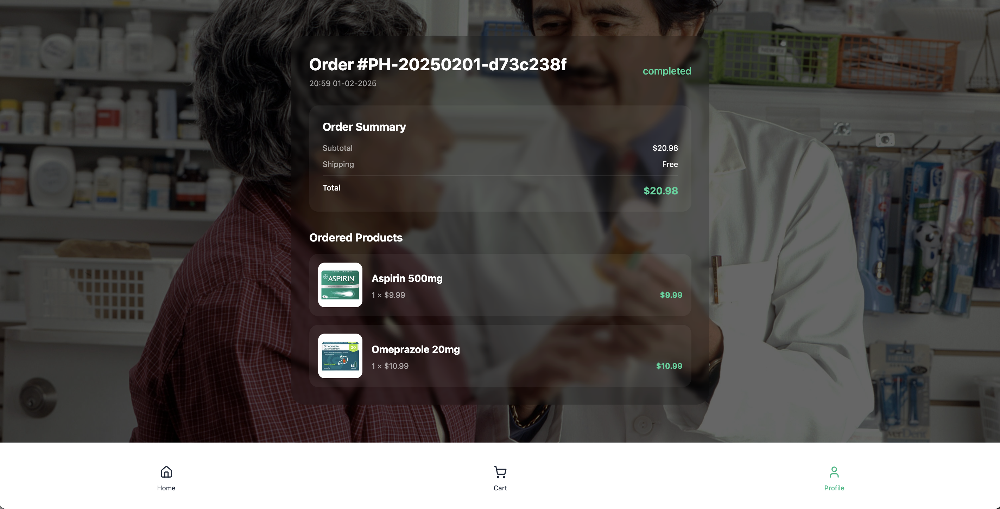
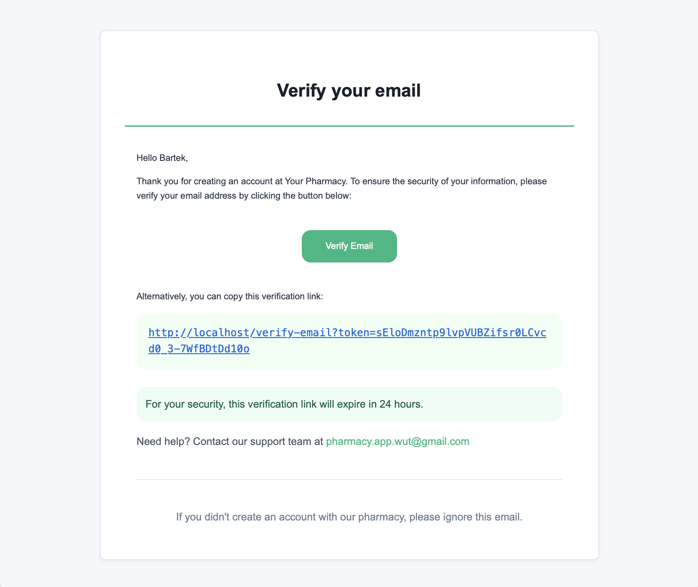
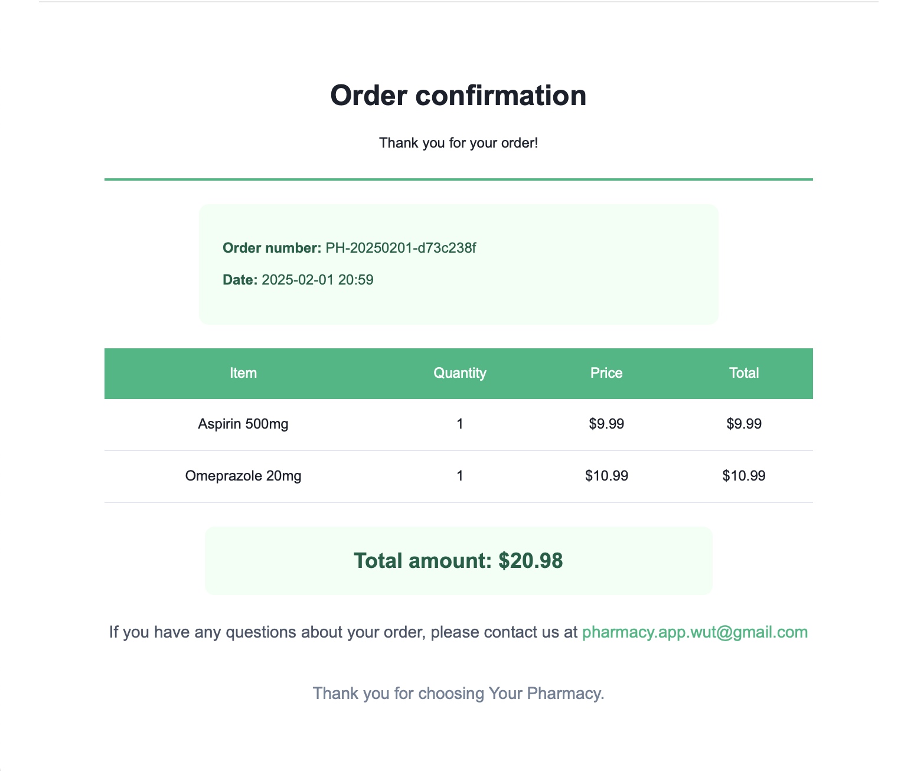

# Your Pharmacy

A full-stack e-commerce solution that brings the pharmacy shopping experience online. Built with Flask, React Native, and PostgreSQL, this modern application provides a seamless shopping experience for health and wellness products.

<div align="center">
  
  <p><em>Landing page with quick access to shopping</em></p>
</div>

## Features

Users can create an account with email verification and track their orders through a personal profile.

<div align="center">
  
  <p><em>Registration form with validation</em></p>
</div>

<div align="center">
  
  <p><em>Profile dashboard with order history</em></p>
</div>

Browse products in grid or list view, with detailed information about each item.

<div align="center">
  
  <p><em>Product catalog in list view</em></p>
</div>

<div align="center">
  
  <p><em>Detailed product view with purchase options</em></p>
</div>

Manage your shopping cart with real-time updates and easy checkout process.

<div align="center">
  
  <p><em>Shopping cart with quantity adjustments</em></p>
</div>

<div align="center">
  
  <p><em>Order details summary</em></p>
</div>

Receive email notifications for account verification and order confirmations.

<div align="center">
  
  <p><em>Account verification email</em></p>
</div>

<div align="center">
  
  <p><em>Order confirmation details</em></p>
</div>

## Technical foundation

The application is built on a modern tech stack that ensures reliability and performance. The backend uses Flask with PostgreSQL for data storage, while the frontend is crafted with React Native and styled using TailwindCSS.

This combination provides a responsive and native-like experience across all devices while maintaining robust development and production environments.

## Dockerized architecture

The entire application is containerized using Docker, with separate containers for the backend, frontend, database, and Nginx as a reverse proxy.

This containerized architecture ensures consistent development and deployment environments, making it easy to scale and maintain.

## Production deployment

Configure Environment Variables in `backend/.env` file with all necessary configuration and specify your host's IP address in `frontend` section of `docker-compose.yml`.

Build and start services:

```bash
docker compose up --build -d
```

Access the application at http://localhost (Port 80). All requests go through Nginx reverse proxy.
